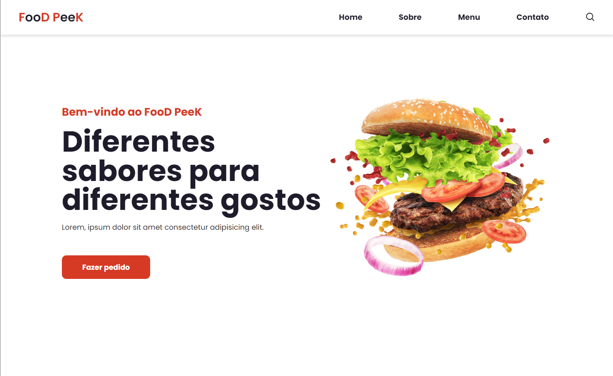

<h1 align="center"> Landing Page Responsiva </h1>

Landing Page responsiva para restaurante fictício chamado Food PeeK.

  <a href="#-tecnologias">Tecnologias</a>&nbsp;&nbsp;&nbsp;|&nbsp;&nbsp;&nbsp;
  <a href="#-projeto">Projeto</a>&nbsp;&nbsp;&nbsp;&nbsp;&nbsp;&nbsp;

 

  

## 🚀 Tecnologias

Esse projeto foi desenvolvido com as seguintes tecnologias:

- HTML e CSS
- JavaScript
- Git e Github

## 💻 Projeto

Uma Landing Page é uma página da WEB com informações básicas do negócio e que, geralmente, há um botão com uma ação para o usuário utilizar.

- [Acesse o projeto finalizado, online](https://nmarcotulio.github.io/projeto_foodpeek/)

- [Referência DEV envolvente](https://www.youtube.com/watch?v=G8rUCF3BY6s)

---

Todos os créditos para o DEV envolvente :wave:
